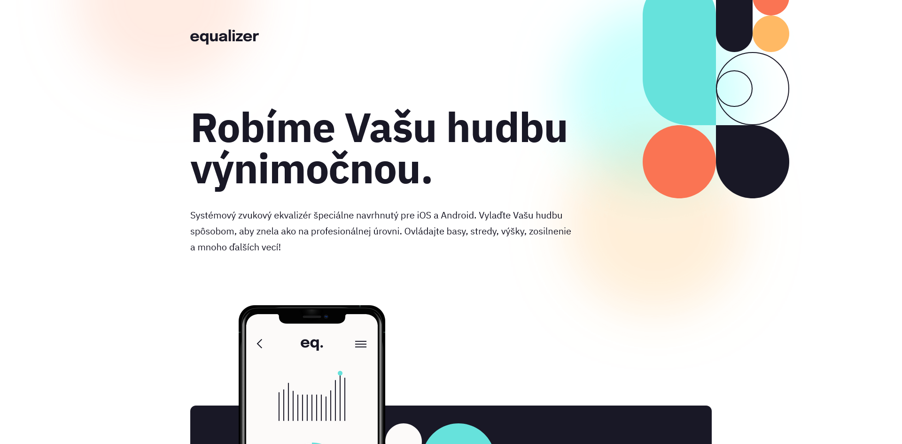
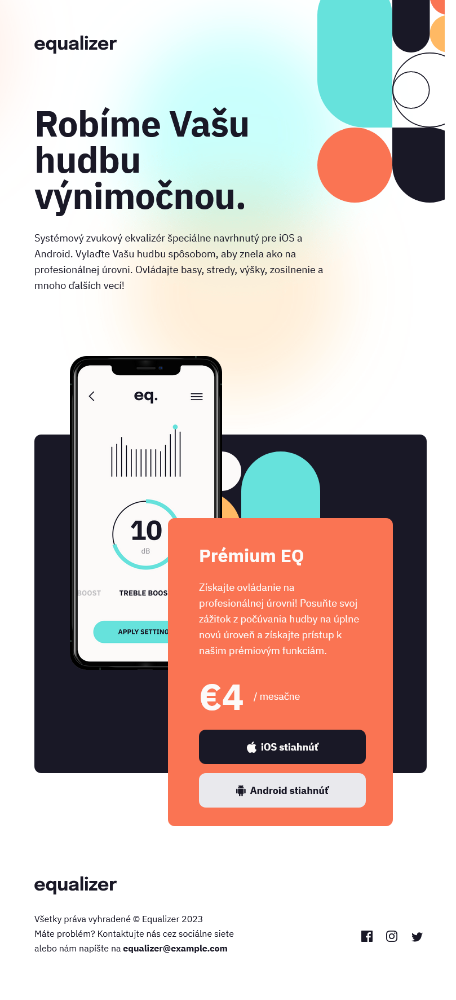
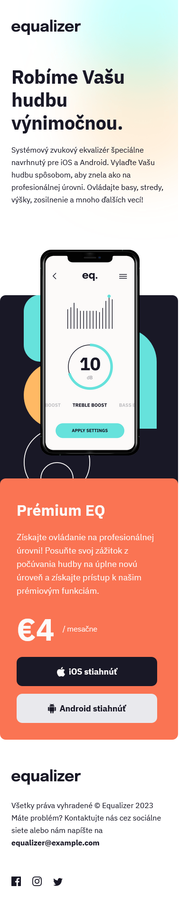

# Frontend Mentor - Equalizer landing page

## 📝 Informácie o projekte

Tento projekt je zo stránky Frontend Mentor ([Equalizer landing page](https://www.frontendmentor.io/challenges/equalizer-landing-page-7VJ4gp3DE)). Projekty zo stránky Frontend Mentor pomáhajú zlepošovať "coding skills" na realistických projektoch. Predlohy projektov sú dostupné na Figme. Anglické texty som upravil na slovenské.

## 🏗️ Vytvorenie projektu

Projekt som vytvoril približne za \*\*\* hodiny. Použil som HTML a CSS. Najviac času mi zabralo vytvorenie responzívneho dizajnu. Prvý krát som robil responzívny dizajn pre tri zariadenia - desktop, tablet a mobil.

#### [Odkaz na stránku s projektom](https://tomasdunik.github.io/frontend-mentor-newbie-nft-preview-card-component-main/)

## 💡 Užitočné zdroje

- [CSS reset](https://www.joshwcomeau.com/css/custom-css-reset/)
- [Vytvorenie "hover" efektu nad hlavným obrázkom](https://www.youtube.com/watch?v=9bGbykdR4T8&ab_channel=TsbSankara)

## 📸 Screenshots

### 💻 Desktop

### 📱 Tablet

### 📱 Mobile

## 🔗 Odkazy

- [Konkrétny projekt na stranke Frontend Mentor](https://www.frontendmentor.io/solutions/nft-preview-card-component-zhhhljGOB3)
- [Moje ostatné projekty na stránke Frontend Mentor](https://www.frontendmentor.io/profile/WeekendsProgrammer)
